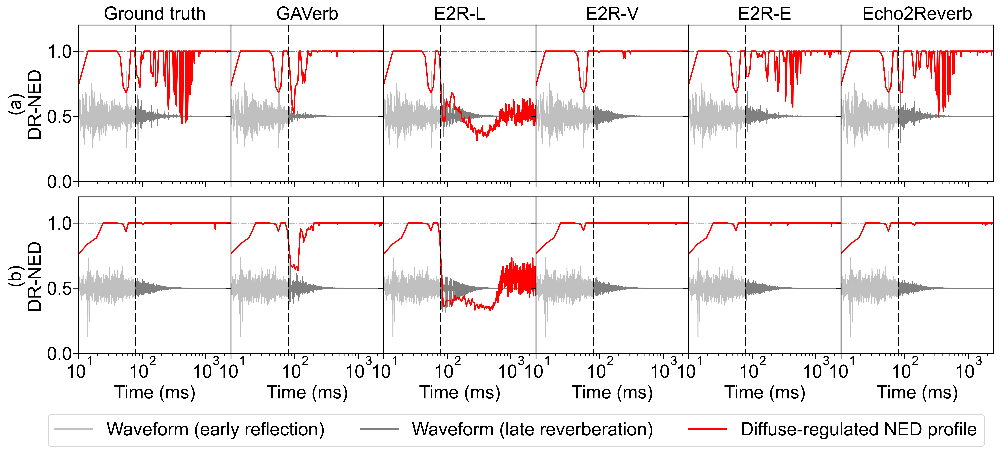
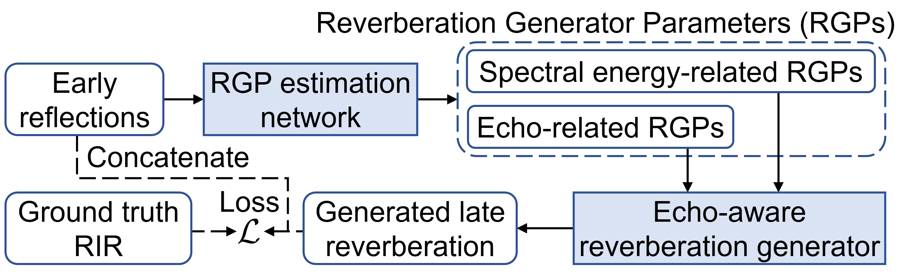
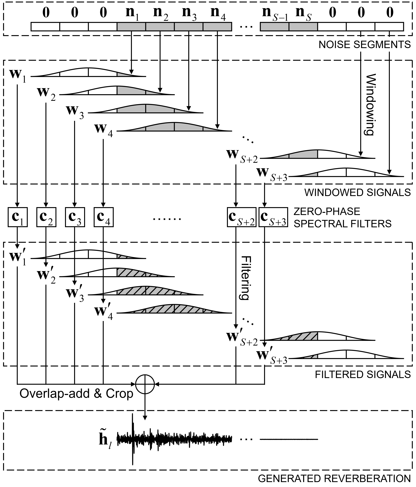

# Echo2Reverb: Echo-Aware Room Impulse Response Generation
### [Paper](https://doi.org/10.1121/10.0027931) | [Project page](https://guanamusic.github.io/Echo2Reverb-demo/)

This repository provides the official implementation (PyTorch) of "Echo-aware room impulse response generation," namely <U>*Echo2Reverb*</U>.



S. Kim, J.-H. Yoo, and J.-W. Choi, "Echo-aware room impulse response generation," The Journal of the Acoustical Society of America 156(1), 623&ndash;637 (2024).

If you want to learn more about our studies, please visit [soundlab](http://www.sound.kaist.ac.kr)!

## Setup

This repository requires Python 3.8+ and Pytorch 1.10+.

1. Clone this repo:
```
git clone https://github.com/guanamusic/echo2reverb.git
cd echo2reverb
```

2. Install requirements:
```
pip install -r requirements.txt
```

## What is Echo2Reverb?

Echo2Reverb is a neural network-based hybrid artificial reverberation framework that generates late reverberation from given early reflections. This framework controls both echo density changes and spectral energy distribution of the generated reverberations by extracting spectral and echo-related features of the early reflection and filtering sampled sparse sequences and Gaussian noises using estimated features.

Synthesizing a room impulse response of 2.5 seconds in length from an 80 ms early reflection takes less than 10 ms from a single GPU and less than 80 ms from a single CPU (tested on NVIDIA GeForce RTX 2080 Ti GPU and Intel® Xeon® Silver 4214 CPU).


<!--  -->


## Training
1. Preparing data
    * Create `.txt` files in the `filelists` directory that contains the file paths of training, validation, and test set.
    * Create or modify a configuration file in `configs` directory to capable with your filelist.

2. Run `runs/train.sh`!
    * Specify the path of your configuration file and GPU device configuration in `runs/train.sh`.
    * Distributed training also supported.
```
sh runs/train.sh
```
**NOTE:** You can also track your training process by tensorboard. Logging information and checkpoints will be stored in `logs/YOUR_LOGDIR`. Modify the `logdir` in the configuration file to specify your `YOUR_LOGDIR`.

## Generation

1. Run `runs/inference.sh`!
    * Specify the path of your configuration file and checkpoints in `runs/inference.sh`.
```
sh runs/inference.sh
```

## Citation

If you find our work useful in your research, please cite **Echo2Reverb**:

```
@article{kim2024echo,
  title={Echo-aware room impulse response generation},
  author={Kim, Seongrae and Yoo, Jae-hyoun and Choi, Jung-Woo},
  journal={The Journal of the Acoustical Society of America},
  volume={156},
  number={1},
  pages={623--637},
  year={2024},
  publisher={AIP Publishing}
}
```
